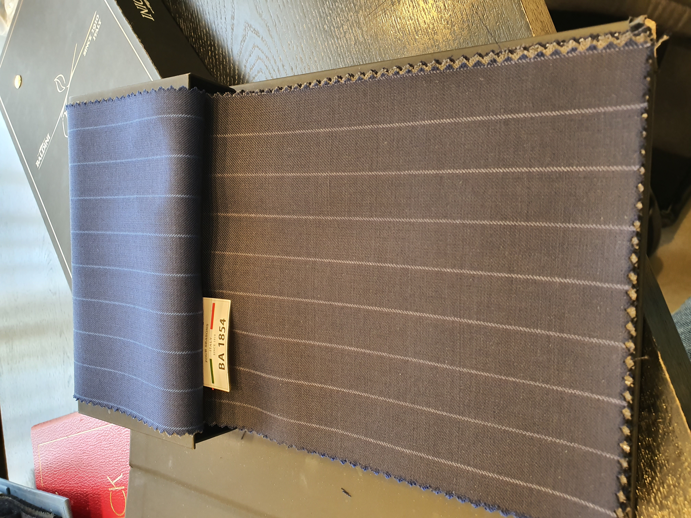

턱시도/맞춤정장
====================

세 군데 들리고 고심 했던 스드메 때와는 달리 한번에 결정한 턱시도와 맞춤 정장
예물 반지 때는 한번에 덜컥 골라서 아쉬움이 남았지만 정장은 계약 후 씁쓸한 뒷맛이 없었다.
접객 차이, 금액 차이 인 것 같은 데 아직 턱시도만 고르고 맞춤 정장은 안 받아서 그런걸지도...?

.. tip::

   - 늘 그렇듯 녹음은 필수 입니다. 녹음 시간은 2시간 정도 찍혀있네요. 시간을 더 줄이긴 힘들겁니다.
   - 대여만 하는 것은 되게 돈 아까울 것 같은 가격 정책을 보입니다. 턱시도 대여 1벌에 40만원, 70만원~ 맞춤정장 구매시 턱시도 3벌 무료 대여
   - 만일 평일에 간다면 원 없이 입어 볼 수 있었을 것 같습니다. 주말에는 사람이 좀 있었네요
   - 드레스랑 달리, 사진 찍는데 제한이 없습니다.

상담 그리고 계약
--------------------------

2020-03-29(일) 날짜로 ``샐****`` 제휴 업체인 ``찰****`` 업체에 예약. 예약 할 때, 오묘하게 기분 나쁜 통화 였던걸로 기억함.
당일 2시에 방문해서 상담을 받았다. 가는 길에 대중교통을 이용 했는데 보름 전 예물 반지 고를때보다는 사람이 많았음.
1호선을 앉아서 갈 수 없었다. 마스크 안 끼고 기침하는 사람은 없었지만, 코훌쩍이는 사람은 있었음

가게에 입장하니, 남성분이 안내를 하며 간단한 설문지 작성을 부탁했다. 설문지 내용은 대략...

- 신랑, 신부 연락처
- 누구 소개?
- 예식일, 예식장

예물반지 때 보다 훨씬 부담이 덜 되는 설문지였다. 우리 예약은 2시였는데, 그 전에 이미 2팀이 와서 뭔가 하고 있었다.
휴대폰 녹음은 입장하기 전에 이미 켜두었다.

상담 해주시는 분이 명함을 건내는 것으로 상담이 시작 되었다. 직함은 본부장. 하지만 사장 느낌 나는 분 이었음.
전화너머로 만날때는 진짜 별로인 사람이었는데, 대면하니까 직업이랑 잘 어울리는 사람이라는 인상을 받았음

가격 정책에 대해서 듣고, 제휴 통해서 온 것에 대한 혜택을 듣고, 턱시도를 입어보는 시간을 가졌다.

예약 안 하면 곤란할 것 같은 사업장 면적이었지만, 예약 없이 온 커플도 있긴 했다. (우리 다음에 1시간 쯤 지나서 왔다)
기다리라고 하고 받긴 하다러, 하긴 마다할 이유가 없긴 하다.

신랑이 워낙 정장 안 입던 사람이라 이거 저거 빈틈 투성이 였는데, 비웃거나 하지 않더라

턱시도 바지를 입고, 복대 까지 하다가, 셔츠 사이즈가 좀 큰 것 같아서 하나 더 작은 사이즈로 다시 갈아입고 나오니
먼저 우리를 상대하던 본부장은 먼저온 더 사람 많은 팀을 상대하러 갔고 진용진 닯은 더 젋은 사람이 우리를 응대하기 시작했다.
재밌던 점은, 다시 바지와 복대를 입혀주면서 설명을 해주었는데 중년이었던 본부장이 하는 설명과 한 글자도 틀리지 않고 그대로 설명을 했다는 것.
어느정도 까지 똑같은 멘트가 나오는지 신기해서 굳이 이미 들었다는 얘기는 하지 않았는데 정말 똑같았다.

6벌 정도의 턱시도를 입어 보았다. 사진을 마음껏 찍을 수 있어서 좋았음

.. .. figure:: placeholser
..   :alt: picture

..   적당히 편집해서 턱시도 입은 사진 올릴 것

먼저 들었던 가격에 대한 얘기를 한번 더 듣고, 결정의 시간을 5~10분 정도 가짐.
신랑은 턱시도가 너무 마음에 들어서 하고 싶어졌다. 그리고 가격도 예상했던 금액 범위였다. (예상은 80만원, 근거는 매형이 그 정도에 맞췄음)
신부는 가족 프로모션을 하고 싶으나, 가족들이 프로모션의 존재에 대해서 모르기 때문에 지금 결정 할 수 없다고 생각 했다.

직원에게 물어보니 시국탓에 원단이 공급이 수월하지 않아 하기로 했던걸 취소하는 것은 가능하나 안하기로 했던걸 추가 하는 건 어렵다고 했다.
하여, 다음 주에 확정하기로하고, 우선은 1+1 프로모션으로 해두고, 턱시도 대여는 1+1이던, 신랑만 하던 할 것이기 때문에 촬영 2벌, 본식 1벌 대여하기로 함

그 길로 계약서에 서명하고, 계약금으로서 70만원을 카드로 결제하고 나옴. 여기까지 ``2시간`` 소요.

그 다음 주, 정장 맞추는 날
--------------------------------------

2020-04-04(토) 오후 1시로 예약

신랑은 전날 가계부 쓴다고 용쓰다가 4시에 자고 일어나, 덜 깬 상태로 급하게 준비하고 나와서 정신이 모자랐다. 이런 사태를 예감하고 일찍이
약속 시간을 수원시청역에서 오전 11시 30분으로 잡았으나 12시 30분에 가까운 시간이 되서야 만났던 듯. 약속시간을 일찍 잡아봐야 가계부쓰는데 오래 걸리는걸 해결해주진 못했다.

1호선은 예물 반지 맞출 때랑 분위기가 확연히 달랐다. 반지 맞출 때 사람들은 얼굴에 불편과 공포가 조금 서려 있었는데, 이 날은 다들 마스크 끼고, 기침 안하고, 피곤해 보였음. 평소의 1호선에 마스크만 더한 느낌.
점심은 가볍고 빠르게 먹을 수 있는 버거킹에서 해결 했다. 미국에 있는 우리 커플의 주선자를 위해 면마스크라도 보낼려고 약국을 조금 들러서 보낼 물건을 구한뒤, 1시 예약해두었던 ``찰****`` 업체에 방문함.

일단은 습관처럼 녹음을 켜뒀으나, 이 날은 이미 구매가 결정된 고객이라 그런지 딱히 어렵지 않았다. 딱히 순서는 상관 없는데, 아마도 원단 설명 부터 들었던 듯. 솔직히 눈으로만 봐서는 국산과 이탈리아산이 구분이 안 갔다.
면-폴리 비율이 중요하다 하는데, 대강 면이 9, 폴리가 1 이라고 들음. 폴리가 많으면 착용감이 편한 대신 교복바지 되어 버린다는 얘기를 들었다.

   고른 원단. 여기에 더블 디자인으로 부탁 했다.

고르면서 이거 저거 많이 물어보고 이리 시켰다, 저리 시켰다 했지만 가게에서 전혀 귀찮아 하지 않았다. 옷 사러갈 때 항상 이렇다면 좋을텐데... 신부는 투톤으로 하자고 했지만,
신랑의 취향으로 하나의 원단으로, 스프라이트 무늬를 넣어서 했다.

지난 주에 못 했던 턱시도 치수를 재고, 정장 치수를 쟀다. 본부장(이지만 사장으로 보이는...)님의 목소리 톤이 좋아서일까? 뭔가 되게 재밌고 기분 좋은 경험이었음. 몸에 줄자대고 숫자 말하면 보조하는 직원이 받아적으면서 복창하는데
귀한 대접 받는 느낌이 들었다.

결제를 하려는 데, 지난주에 약속했던 10만원 할인을 빼고 말하는 바, 지난 주에 약속하셨는데요? 하니 바로 10만원이 할인 되었다.
그리고 일주일 전에 코로나 때문에 영국원단은 입수가 불가능 하다고 설명 했었는데, 이 날은 그 얘길 하지 않고, 이렇게 비싼것 까지는 보실 필요 없다. 로 설명하는 차이가 있었음.
결제를 하고 나와서, 영국 원단 얘기와 10만원 할인한 것을 가지고 이야기를 하며 나옴. 이 때 얘기로 신부는 투톤을 해야 더 비싼걸 받는거라 생각했다고..
신랑은 그 말이 맞지만, 비용이 크다고 품질이 좋아지는 것은 아니고, 안그래도 원단 배송타령 하는데 받는데 더 힘들기만 할 것.. 이라 생각했음.

녹음 파일의 길이를 보니 1시간 정도 되더라.

다음 일정을 위해 이동하던 중에 길에서 신용카드를 주웠음. 신랑은 이런거 잘 발견하고, 신부는 이럴걸 보면 못 본 척 못 하는 사람이라 경찰서 위치까지 찾아 봄.
경찰서가 너무 먼데 있어서 보다 가까운 우체통에 고이 넣어드림.

장모님이 넥타이를 사주고 싶다고 하셔서, 그리고 신부 남동생이 정장이 없어서, 파크랜드에 가서 옷을 좀 더 고르고 구매 함. 감사합니다.
파크랜드의 옷들 가격을 보니, ``찰****`` 의 가격은 너무 저렴해 보였음. 기성품 가격이 이 따위인데 맞춤을 그 가격에?
이날 상갈역 근처에 신혼집으로 염두에 두던 아파트 단지를 구경갈까 하다가 신부가 피곤하다 하여 관두고 다음을 기약했다.

4월 28일  가봉스냅용 턱시도 빌리는 날
--------------------------------------------

6시 방문 예약 해두고 정확히 6시에 신랑신부 함께 도착. 턱시도 2벌 입어보고, 바지 5mm 정도 더 접고 다시 입어보는데 1시간 정도 사용
녹음을 하긴 했는데, 추가적으로 돈 쓴것도 없고 굳이 활용할 것 같진 않음.

턱시도 무겁더라...  반납은 토탈샵에 두고가도 된다고 들었음.

맞춤 정장을 위한 가봉 치수 재기 1차
---------------------------------------------

5월 10일에 가게에서 먼저 전화가 왔다. 원단 공급이 늦어져서 지연되고 있는데, 궁금하실까봐 연락 드린다고 하며, 다음 주 쯤에 물건 오면 먼저 연락 주겠다고 말했다.
먼저 연락 준다고 말했기에 별로 신경 쓰지 않고 지냈다.

연락이 안와도 너무 안온다 싶어 달력을 보니 6월 9일. 어떻게 된 것인지 전화로 묻자, 내일 물건이 들어오니 다음 주 중에 예약 잡으면 된다고 한다.
아무리 생각해도 가게에서 잊어 먹은 것이다. 다시 전화 준다고 하고 끊었다. 6월 11일에 다가오는 토요일인 6월 13일에 가능하냐고 물었고, 가능하다는 답을 들었다.

은근 통화 할일이 많다. 그래서 테일러샵과는 녹음 파일이 많다.

6월 13일, 예약 시간에 도착하니 우리 포함 4 커플이 가게에 있었다. 가게 규모상 동시에 2 팀이상 받을 수 없는 가게인데... 다행히 앞 2 커플은 얼마 안 있다가 나갔다.

신부가 아마 9월에 결혼하는 사람들 이지 않을까? 라고 했다. 그게 맞다면 이제 사람들이 더이상 코로나19를 두려워 하지 않는다는 말이 된다.
3월 ~ 5월 결혼식은 많이 취소되고 1년 뒤로 미뤘다고 들었는데, 그 사람들만 불쌍하게 되었다.
한국 결혼 시장은 수요가 늘어나지 않을 게 너무 뻔히 보여서 새로 시작하는 가게가 적을 것이고, 또한 가게 명성이 사업에 있어서 중요한 척도이기 때문에... 더더욱 새 서비스 공급자는 없을 것 이다.
헌데, 내년 봄 결혼식만 일시적으로 수요가 2배가 되었다. 공급자는 한정되어 있으므로 내년 결혼식을 진행하는 커플들은 추가적인 비용을 부담해야 하거나, 질 나빠진 서비스를 받아야 할 것 이다.
겪어보고 느낀점인데, 결혼 사업은 배짱 장사를 할 수 있는 조건이 맞춰져있어서 저런 상황이 되면 배짱 장사를 할 것이다.
더욱이, 내년에 코로나19가 해결되리란 보장도 없다.

... 같은 생각을 하며 기다리니, 한 15분 쯤 지나자 우리 차례가 되었다. 뭔가 바느질이 많이 부족해 보이는 상태의 옷이 신랑을 기다리고 있었고 40분쯤 사용해서 몸 치수를 다시 재었다.
다음주에 한번 더 오라고 한다. 그때는 거의 옷 처럼 생긴 형태가 기다리고 있을거라고 한다.

아마도 최소 2번은 더 가야 할 듯 싶다.

맞춤 정장을 위한 가봉 치수 재기 2차
---------------------------------------------

6월 21일 오후 2시, 갔더니 이번에도 가게가 바빴다. 두 팀이 먼저 하고 있는데, 대기석에서 잘 보이는 쪽 자리에서 상담 받는 커플은 보아하니 오늘이 처음 온 날이었음.
한 주 전에 했던 생각에 근거가 하나 더 해지는 느낌이 들었다. 불안하긴 하지만 미루지 않은게 나았던 것..

가봉 자체는 짧게 끝났다. 15분 정도 밖에 안 걸렸고, 이번엔 옷의 형태를 거의 갖춘 상태라서 보는 맛이 있었음.
아는 사람이 결혼한다고 하면, 맞춤 정장은 하는걸 추천하고 싶다. 신랑이 우선인 이벤트는 이거 뿐인 것 같고, 대접 받는 느낌이 들며, 일단 재밌음.

미세 조정 하고 싶으면 예약 하라고 했고, 그래서 식 올리기 1주 전에 와서 하고, 수령하겠다고 했다. 7/11일 오후 3시로 예약함.
이 때 영업용 컴퓨터에 띄워진 구글 캘린더를 보게 되었는데.. 어 일주일간은 예약이 가득 찾더라. 코로나고 뭐고 할 결혼은 해야지 분위기로 흘러가는 듯...

